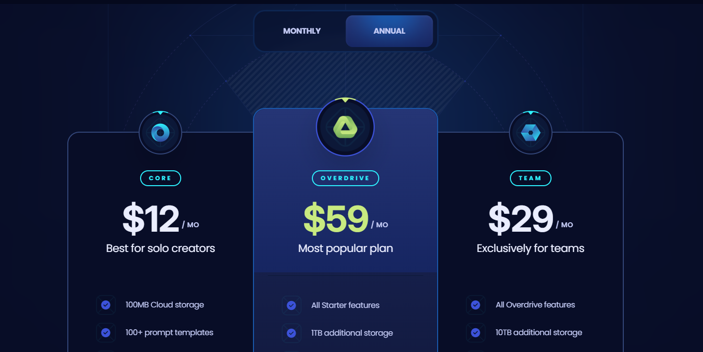

# SaaS Landing Page

## Summary

This elegant and artistic SaaS landing page is inspired by the design of XORA, a service for AI-powered file editing. The page features a clean and modern layout, focusing on user experience and visual appeal. With subtle, pleasing animations, it creates an engaging atmosphere, inviting visitors to explore the capabilities of the service. Designed to be both functional and visually captivating, this landing page effectively captures the essence of AI-driven innovation while maintaining a user-friendly interface.

## Features

- 🎨 **Modern Layout**: Clean, visually pleasing design focused on user experience.
- ✨ **Subtle Animations**: Interactive animations that enhance user engagement.
- 🤖 **AI-Powered Service Showcase**: Highlights the core functionality of AI-driven file editing.
- 📱 **Responsive Design**: Optimized for various screen sizes and devices.

## Tech Stack

- ⚛️ **Frontend**: React, TypeScript, JavaScript
- 🎨 **Styling**: Tailwind CSS

## Demo

View the live demo of the SaaS Landing Page at:  
[https://sass-page-001.netlify.app/](https://sass-page-001.netlify.app/)

## Project Image



## How to Run Locally

1. Clone the repository:

   ```bash
   git clone https://github.com/Radexman/sass-page.git
